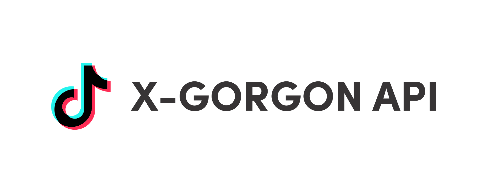

<div align="center">
  
</div>

<h2 align="center">
  TikTok X-Gorgon API 💻
</h2>

<p align="center">
  <strong>Tiktok's internal API</strong> requires <strong>x-gorgon</strong> and <strong>x-khronos</strong> headers, and these can be acquired on this <strong>API</strong>
</p>

### Docs :closed_book:
```curl
POST http://localhost/api/generate
```

### Princing 💲
&nbsp;&nbsp; After 7 days trial **$15**/month

### Contact
- [Telegram]()
- [Discord]()
